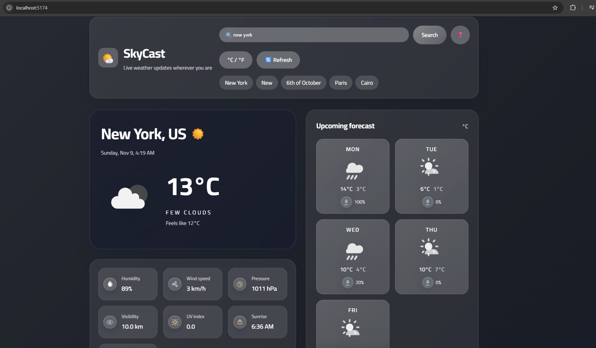
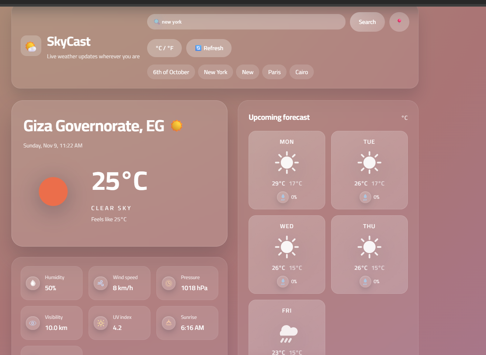

# Weather App Vue

A modern weather experience built with Vue 3 + Vite, featuring OpenWeatherMap integration, dynamic theming, and a fully modular architecture.

## 🌐 Live Demo

- [weather-app-6bql.vercel.app](https://weather-app-6bql.vercel.app/)

## ✨ Features

- City search with geocoding & GPS location support
- Current conditions with detailed metrics (humidity, pressure, UV, etc.)
- Five-day forecast cards with rain probability
- Temperature unit toggle (°C ↔ °F)
- Persistent last searched city via `localStorage`
- Elegant loading states, background gradients, and iconography
- Robust error handling with retry flow
- Responsive layout with glassmorphism styling

## 🛠️ Tech Stack

- Vue 3 (Composition API, `<script setup>`)
- Vite build tooling
- Axios HTTP client
- OpenWeatherMap APIs (`/weather`, `/forecast`, `geo/1.0/direct`)

## 🚀 Getting Started

```bash
npm install
npm run dev
```

The dev server will open at `http://localhost:5174`.

## 🔑 Environment Variables

Create a `.env` file based on `.env.example`:

```
VITE_WEATHER_API_KEY=your_api_key_here
VITE_API_BASE_URL=https://api.openweathermap.org/data/2.5
VITE_GEOCODING_BASE_URL=https://api.openweathermap.org/geo/1.0
VITE_ICON_BASE_URL=https://openweathermap.org/img/wn/
```

## 📁 Project Structure

```
weather-app-vue/
├── public/
├── src/
│   ├── assets/
│   │   ├── images/
│   │   └── styles/
│   ├── components/
│   ├── composables/
│   ├── constants/
│   ├── services/
│   ├── utils/
│   ├── types/
│   ├── App.vue
│   └── main.js
├── package.json
└── vite.config.js
```

## 📸 Screenshots




## 🧪 Available Scripts

| Command          | Description                 |
| ---------------- | --------------------------- |
| `npm run dev`    | Start local dev server      |
| `npm run build`  | Production build            |
| `npm run preview`| Preview production build    |
| `npm run lint`   | Run ESLint over src files   |

## 📚 Further Improvements

- Hourly forecast chart
- Recent search history
- Dark mode toggle
- PWA & offline caching

Enjoy building! 🌤️
